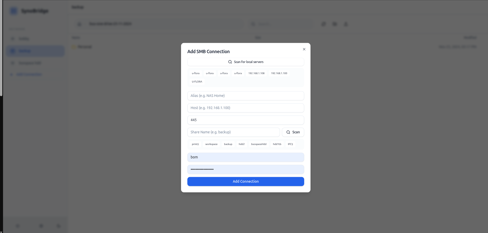
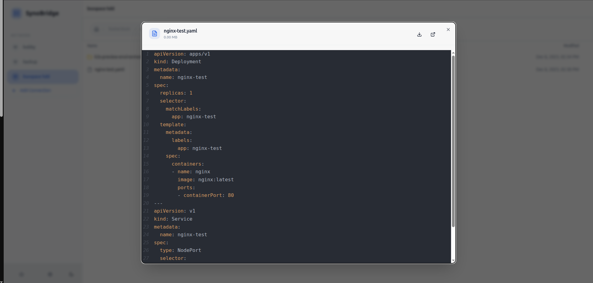
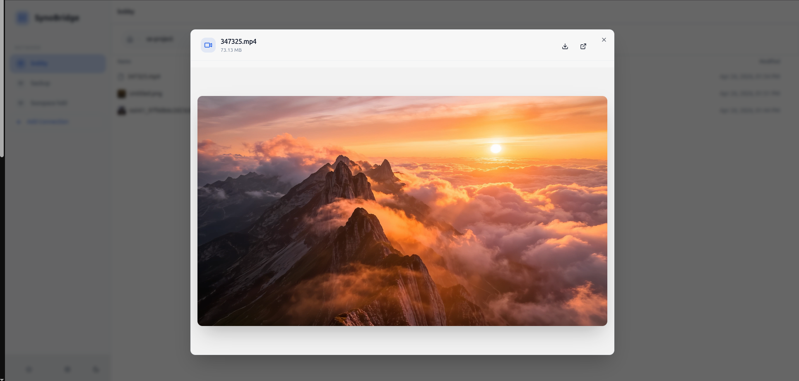
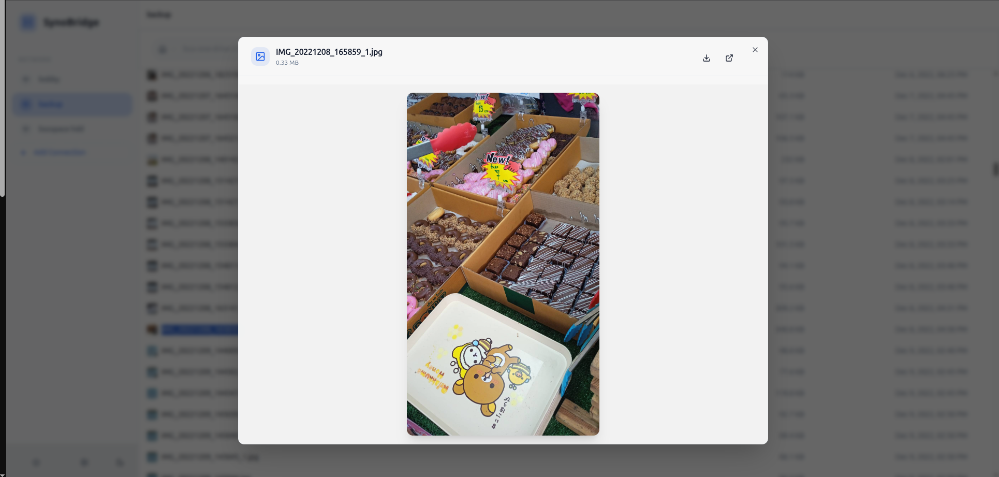
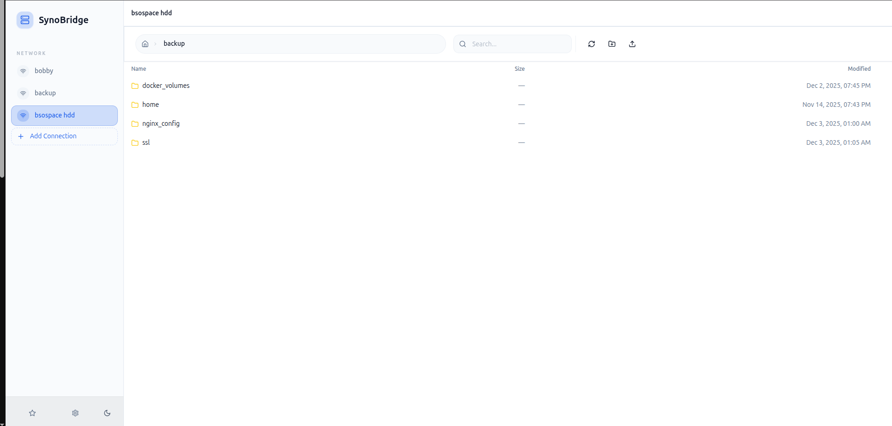

# SynoBridge 🚀

SynoBridge is a modern, high-fidelity web application designed to seamlessly bridge legacy SMB NAS units and file servers into a sleek, fast, and secure web experience. It features a cross-platform Bridge Agent and a beautiful React-based frontend.

## 📸 UI Overview










---

## 🚀 Quick Start (Production)

SynoBridge is packaged as a single, highly efficient, all-in-one Docker image containing both the backend API and the compiled React frontend.

**You do not need to clone this repository to run SynoBridge.**

### Option A: Using Docker Compose (Recommended)

1. Create a new directory on your server and create a `docker-compose.yml` file:

```yaml
services:
  synobridge:
    image: boytur/synobridge:latest
    container_name: synobridge
    network_mode: host
    environment:
      - GIN_MODE=release
      - PORT=4455 # Change this to whatever port you prefer
      - DB_PATH=/data/synobridge.db
      - ENCRYPTION_KEY=changeme32byteskey1234567890123
      # Optional: Add your Auth0 variables here to enable authentication
      # - AUTH0_DOMAIN=your-tenant.auth0.com
      # - AUTH0_AUDIENCE=your-api-identifier
      # - ALLOWED_EMAILS=user1@example.com,user2@example.com
    volumes:
      - ./data:/data
    restart: unless-stopped
```

*(Note: We use `network_mode: host` so the backend can correctly discover Bridge Agents via mDNS on your local network.)*

2. Start the server:

```bash
docker compose up -d
```

3. Open your browser and navigate to `http://localhost:4455` (or your server's IP address).

---

### Option B: Using Docker Run

If you prefer a quick one-liner command:

```bash
docker run -d \
  --name synobridge \
  --network host \
  -v $(pwd)/data:/data \
  -e GIN_MODE=release \
  -e PORT=4455 \
  -e DB_PATH=/data/synobridge.db \
  -e ENCRYPTION_KEY=changeme32byteskey1234567890123 \
  boytur/synobridge:latest
```

---

## 📡 Deploying the Bridge Agent (Legacy NAS Connect)

To connect a legacy network share, you need to run the **Bridge Agent** on a machine within the same local network as the file server.

1. Clone this repository and navigate to the `bridge/` directory.
2. Build the agent for your target OS:
   ```bash
   # For Linux
   cd bridge
   GOOS=linux GOARCH=amd64 go build -o synobridge-agent main.go

   # For Windows
   cd bridge
   GOOS=windows GOARCH=amd64 go build -o synobridge-agent.exe main.go
   ```
3. Run the executable. It will safely broadcast its presence via mDNS and host a local setup UI on port `8888`.
4. Open the agent's local IP (e.g., `http://localhost:8888`) to securely configure the target credentials and magically link the NAS to your SynoBridge workspace!

Enjoy your modern file management experience! 🎉
